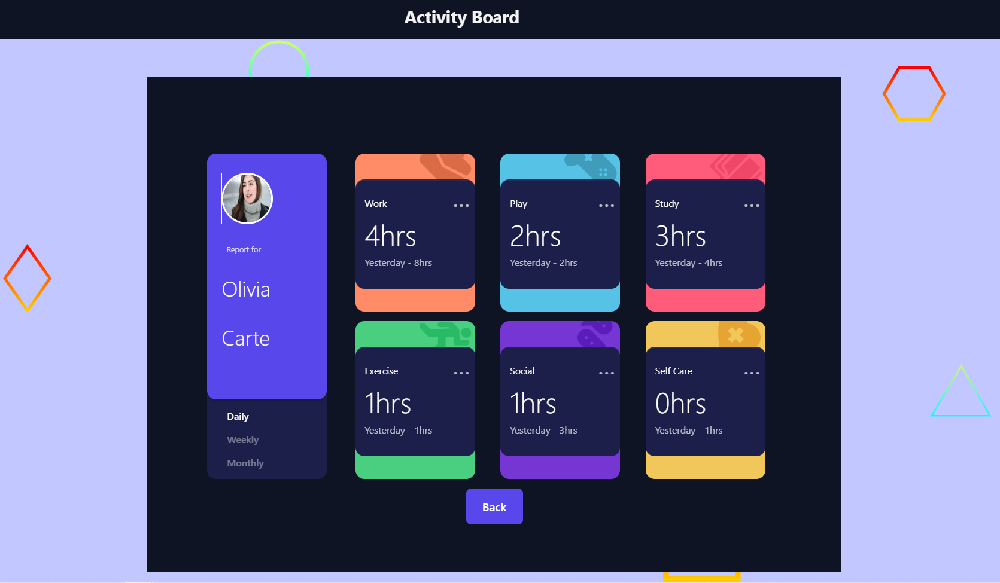

# Activities Dashboard

This is inspired by a Front-End Mentor project: [Time tracking dashboard](https://www.frontendmentor.io/challenges/time-tracking-dashboard-UIQ7167Jw).

I choose to make some modifications.(sorry front-end-mentor)

## Table of contents

- [Overview](#overview)
  - [The challenge](#the-challenge)
  - [Screenshot](#screenshot)
  - [Links](#links)
- [My process](#my-process)
  - [Built with](#built-with)
  - [What I learned](#what-i-learned)
  - [Useful resources](#useful-resources)
- [Author](#author)

## Overview

### The challenge

- Your challenge is to build out this dashboard and get it looking as close to the design as possible.
- You can use any tools you like to help you complete the challenge. So if you've got something you'd like to practice, feel free to give it a go.
- If you would like to practice working with JSON data, we provide a local data.json file for the activities. This means you'll be able to pull the data from there instead of using the content in the .html file.
- Your users should be able to:
  - View the optimal layout for the site depending on their device's screen size
  - See hover states for all interactive elements on the page
  - Switch between viewing Daily, Weekly, and Monthly stats

### Screenshot

### Links

- Solution URL: [Repository](https://github.com/LazezBZH/activities-board)
- Live Site URL: [Deployment on Netlify](https://activities-board.netlify.app/)

## My process

### Built with

- Semantic HTML5 markup in jsx
- CSS custom properties
- Flexbox
- mobile first
- [React](https://reactjs.org/) - JS library
- [Vite](https://vitejs.dev/)

### What I learned

- Add an error boundary.
- Interraction with Clipboard.
- Create a pseudo auth (just in the js front so easily hackable but that was not my main goal ).
- I tried to be as rigorous as possible with responsive level, I coded in mobile first.

### Useful resources

- [Navigator.clipboard](https://developer.mozilla.org/en-US/docs/Web/API/Navigator/clipboard)
- [Vite](https://vitejs.dev/)
- [Error boundary](https://www.npmjs.com/package/react-error-boundary)

## Author

- Website - [Bénédicte Hérault](https://lazez-bzh.netlify.app/)
- LinkedIn - [B. HÉRAULT](https://www.linkedin.com/in/benedicte-herault/)
